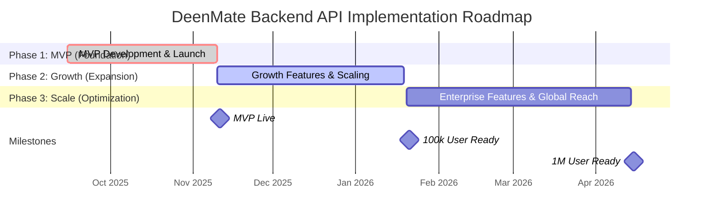

# DeenMate Backend API - Implementation Roadmap

**Date**: September 4, 2025  
**Purpose**: A strategic, phased plan for developing, deploying, and scaling the DeenMate backend API.  
**Framework**: Agile, iterative development focused on delivering value quickly and adapting to user needs.  

---

## Executive Summary

This document outlines a three-phase implementation roadmap for the DeenMate backend API. The roadmap is designed to deliver a Minimum Viable Product (MVP) rapidly, followed by structured phases for growth and large-scale operation. Each phase includes clear deliverables, timelines, resource requirements, and risk assessments to guide the development team from initial setup to a globally available, high-performance system.

---

## 1. Roadmap Overview & Timeline

The implementation is divided into three main phases, designed for iterative delivery and continuous improvement.

| Phase                  | Timeline            | Primary Goal                                       | Target Users | Key Outcome                               |
|------------------------|---------------------|----------------------------------------------------|--------------|-------------------------------------------|
| **1. MVP (Foundation)**| 8 Weeks (Q4 2025)   | Launch core API to validate the backend architecture | < 10,000     | A stable, functional API serving the app. |
| **2. Growth (Expansion)**| 10 Weeks (Q1 2026)  | Enhance features, improve performance, and scale.  | < 100,000    | A feature-rich, scalable platform.        |
| **3. Scale (Optimization)**| 12 Weeks (Q2 2026)  | Achieve enterprise-grade reliability and global reach. | > 1,000,000  | A highly optimized, globally distributed system. |

---

## 2. Phase 1: MVP (Foundation)

**Duration**: 8 Weeks (September 15, 2025 - November 10, 2025)  
**Goal**: Build and launch the core backend API to replace direct third-party API calls from the mobile app.

### Deliverables:
- **Core API Endpoints**:
    - `GET /prayer-times`: Prayer times from Aladhan API.
    - `GET /quran/chapters/{id}/verses`: Quran verses from the database.
    - `GET /zakat/metals`: Gold/silver prices from Metals API.
    - `POST /users`: User creation and profile setup.
    - `POST /auth/token`: JWT-based authentication.
- **Infrastructure**:
    - Single-region AWS deployment (us-east-1).
    - Production PostgreSQL and Redis instances.
    - Basic CI/CD pipeline for automated deployment.
- **Data Synchronization**:
    - Initial data import for Quran text and translations.
    - Nightly jobs to sync prayer times and metal prices.
- **Mobile App Integration**:
    - Update the Flutter app to point to the new `api.deenmate.app` endpoints.
    - Implement offline-first strategy with the new API data structures.

### Team & Resources:
- **Team**:
    - 1x Backend Lead / Architect
    - 2x Backend Developers (FastAPI)
    - 1x DevOps Engineer
    - 1x Mobile Developer (Flutter)
    - 1x QA Engineer
- **Budget**: ~$4,500/month (as per `infra-costs.md`)

### Risks & Mitigations:
| Risk                                  | Likelihood | Impact | Mitigation Strategy                                                              |
|---------------------------------------|------------|--------|----------------------------------------------------------------------------------|
| **Third-Party API Unreliability**     | Medium     | High   | Implement robust caching, circuit breakers, and fallback mechanisms.             |
| **Data Migration Issues**             | Low        | High   | Perform dry runs of data import scripts; validate data integrity post-migration. |
| **Delay in Mobile App Integration**   | Medium     | Medium | Maintain close collaboration between backend and mobile teams; use API contracts. |

---

## 3. Phase 2: Growth (Expansion)

**Duration**: 10 Weeks (November 10, 2025 - January 20, 2026)  
**Goal**: Add new features, enhance existing ones, and scale the infrastructure to support a growing user base.

### Deliverables:
- **New Features**:
    - **Hadith Module**: Integrate Sunnah.com API data into the database and expose via `GET /hadith/...` endpoints.
    - **Full-Text Search**: Implement Elasticsearch for Quran and Hadith search.
    - **User Personalization**: Bookmarks, notes, and reading history (`POST /users/me/bookmarks`).
    - **Social Features**: Share verses or hadiths.
- **Infrastructure Scaling**:
    - Implement auto-scaling for API services.
    - Introduce database read replicas to handle increased read traffic.
    - Set up a multi-AZ deployment for high availability.
- **Observability**:
    - Deploy Prometheus and Grafana for advanced monitoring.
    - Implement structured logging (ELK stack).
    - Set up alerting for critical system metrics.
- **Performance Optimization**:
    - Fine-tune database queries and add necessary indexes.
    - Optimize caching strategies for popular content.

### Team & Resources:
- **Team**:
    - 1x Backend Lead / Architect
    - 3x Backend Developers
    - 2x DevOps Engineers
    - 2x Mobile Developers
    - 2x QA Engineers
- **Budget**: ~$10,500/month

### Risks & Mitigations:
| Risk                                  | Likelihood | Impact | Mitigation Strategy                                                              |
|---------------------------------------|------------|--------|----------------------------------------------------------------------------------|
| **Performance Bottlenecks**           | High       | Medium | Conduct regular load testing; use APM tools to identify and fix bottlenecks early. |
| **Sunnah.com API Integration Delays** | Medium     | Medium | Start negotiations and technical exploration early; build a flexible data model. |
| **Increased Infrastructure Costs**    | High       | Low    | Implement cost monitoring and alerts; use reserved instances and spot instances.  |

---

## 4. Phase 3: Scale (Optimization)

**Duration**: 12 Weeks (January 20, 2026 - April 14, 2026)  
**Goal**: Refactor and optimize the platform for enterprise-grade performance, reliability, and global scale.

### Deliverables:
- **Global Infrastructure**:
    - **Multi-Region Deployment**: Deploy the API to regions in Europe, ME, and APAC.
    - **Global Load Balancing**: Use Cloudflare or AWS Global Accelerator to route users to the nearest region.
    - **Data Replication**: Set up cross-region replication for the database and cache.
- **Advanced Features**:
    - **AI/ML**: Recommendations for Islamic content (e.g., "Verse of the Day").
    - **Audio Streaming**: Build a resilient audio streaming service for Quran recitations using the multi-CDN strategy.
    - **Live Events**: Infrastructure to support live streams (e.g., Taraweeh prayers during Ramadan).
- **Security & Compliance**:
    - Conduct a full third-party penetration test.
    - Achieve compliance with relevant data protection regulations (e.g., GDPR, CCPA).
    - Implement advanced security measures (WAF tuning, DDoS protection).
- **DevOps Maturity**:
    - Implement Infrastructure as Code (Terraform) for all environments.
    - Set up a formal disaster recovery plan and conduct regular DR drills.
    - Blue-green or canary deployment strategies for zero-downtime releases.

### Team & Resources:
- **Team**:
    - 1x Backend Lead / Architect
    - 4x Backend Developers
    - 1x Data Scientist / ML Engineer
    - 3x DevOps/SRE Engineers
    - 2x Mobile Developers
    - 2x QA Engineers (with performance/security focus)
- **Budget**: ~$36,000/month

### Risks & Mitigations:
| Risk                                  | Likelihood | Impact | Mitigation Strategy                                                              |
|---------------------------------------|------------|--------|----------------------------------------------------------------------------------|
| **Data Consistency in Multi-Region**  | Medium     | High   | Choose an appropriate data replication strategy; handle potential conflicts.     |
| **Complexity of Global Infrastructure**| High       | High   | Hire experienced SREs; invest heavily in automation and monitoring.              |
| **Security Breach at Scale**          | Low        | Critical| Adopt a defense-in-depth security posture; conduct regular security audits.      |

---

## 5. Post-Launch & Continuous Improvement

Beyond Phase 3, the focus will shift to ongoing optimization, innovation, and maintenance.

- **Quarterly Planning**: Re-evaluate priorities and plan new features based on user feedback and business goals.
- **A/B Testing**: Implement an A/B testing framework to experiment with new features and user experiences.
- **Cost Optimization**: Continuously review and optimize infrastructure costs.
- **Technology Refresh**: Stay current with new technologies and refactor legacy components as needed.

---

**Roadmap Completed**: September 4, 2025  
**This document provides a clear path forward for the DeenMate backend team, enabling strategic planning and successful execution.**
