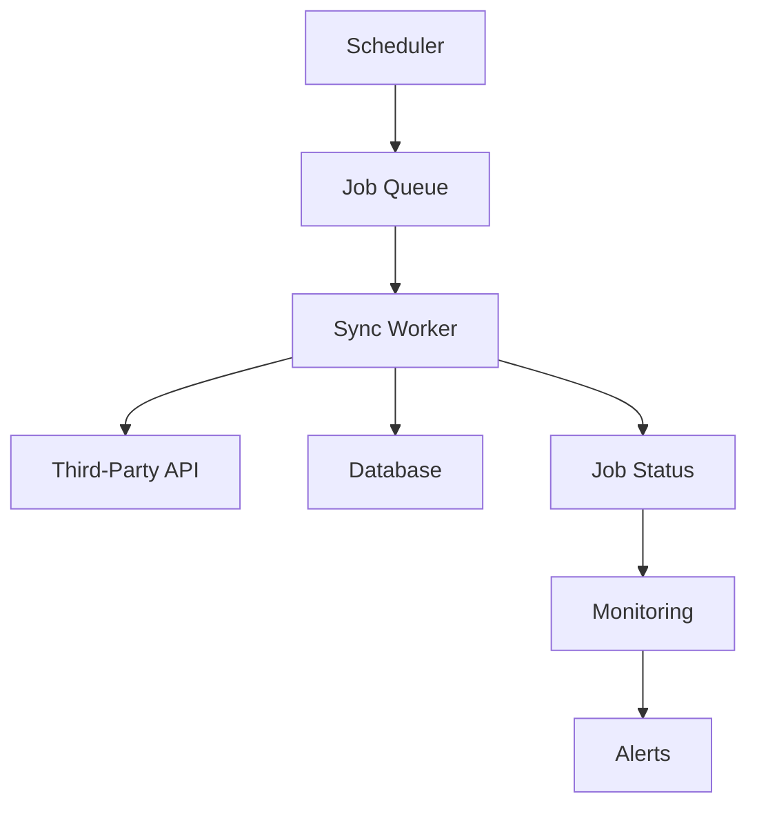

# DeenMate Backend API Layer - Data Sync Strategy & Jobs

**Date**: September 3, 2025  
**Purpose**: Define synchronization strategies for Islamic content from third-party APIs  
**Framework**: Robust, scheduled, and monitored data synchronization system  

---

## Executive Summary

This document outlines comprehensive data synchronization strategies for DeenMate's backend API. The system is designed to maintain fresh, accurate Islamic content while minimizing API calls, handling failures gracefully, and ensuring data consistency across all modules.

---

## 1. Sync Architecture Overview

### 1.1 Core Principles

- **Cache-First**: Backend serves from database, syncs in background
- **Incremental Updates**: Only sync changed data when possible
- **Fault Tolerance**: Graceful handling of API failures and rate limits
- **Monitoring**: Full visibility into sync job status and performance
- **Idempotency**: Safe to run sync jobs multiple times

### 1.2 Sync Job Framework



**Technologies**:
- **Queue**: Redis/BullMQ for job scheduling
- **Worker**: Node.js/Python workers with retry logic
- **Monitoring**: Prometheus metrics + Grafana dashboards
- **Alerting**: Email/Slack notifications for failures

---

## 2. Quran Data Sync Strategy

### 2.1 Sync Categories

| Data Type | Frequency | Priority | TTL | Strategy |
|-----------|-----------|----------|-----|----------|
| **Chapters** | Once/week | Critical | 7 days | Full sync |
| **Verses** | Once/week | Critical | 7 days | Full sync |
| **Translations** | Daily | High | 1 day | Incremental |
| **Reciters** | Daily | Medium | 1 day | Incremental |
| **Audio Metadata** | Weekly | Low | 7 days | Incremental |

### 2.2 Quran Sync Jobs

#### 2.2.1 Chapter Sync Job

```yaml
job_name: sync_quran_chapters
schedule: "0 2 * * 0"  # Weekly at 2 AM Sunday
priority: critical
timeout: 30 minutes
retry_attempts: 3
```

**Process Flow**:
1. Fetch all chapters from Quran.com API
2. Compare with existing database records
3. Update changed chapters (rare)
4. Log sync statistics
5. Update data version hash

**Implementation**:
```javascript
async function syncQuranChapters() {
  const startTime = Date.now();
  let processed = 0, updated = 0, failed = 0;
  
  try {
    // Fetch from API with retry logic
    const chapters = await fetchWithRetry('https://api.quran.com/api/v4/chapters');
    
    for (const chapterData of chapters.chapters) {
      try {
        const existingChapter = await db.chapters.findByNumber(chapterData.chapter_number);
        
        if (!existingChapter || hasChanged(existingChapter, chapterData)) {
          await db.chapters.upsert({
            chapter_number: chapterData.chapter_number,
            name_arabic: chapterData.name_arabic,
            name_english: chapterData.name_simple,
            revelation_place: chapterData.revelation_place,
            verse_count: chapterData.verses_count,
            updated_at: new Date()
          });
          updated++;
        }
        processed++;
      } catch (error) {
        logger.error(`Failed to sync chapter ${chapterData.chapter_number}:`, error);
        failed++;
      }
    }
    
    // Update sync status
    await updateSyncStatus('quran_chapters', {
      status: 'completed',
      processed,
      updated,
      failed,
      duration: Date.now() - startTime
    });
    
  } catch (error) {
    await updateSyncStatus('quran_chapters', {
      status: 'failed',
      error: error.message,
      duration: Date.now() - startTime
    });
    throw error;
  }
}
```

#### 2.2.2 Translation Sync Job

```yaml
job_name: sync_quran_translations
schedule: "0 3 * * *"  # Daily at 3 AM
priority: high
timeout: 2 hours
retry_attempts: 3
```

**Strategy**: Incremental sync based on `last_modified` headers

**Process**:
1. Check each translation resource for updates
2. Sync only modified translations
3. Update full-text search vectors
4. Validate data integrity

---

## 3. Prayer Times Sync Strategy

### 3.1 Location-Based Caching

**Challenge**: Prayer times are location-specific and date-specific  
**Solution**: Pre-cache popular locations and calculate on-demand for others

### 3.2 Prayer Times Jobs

#### 3.2.1 Popular Locations Sync

```yaml
job_name: sync_popular_prayer_times
schedule: "0 1 * * *"  # Daily at 1 AM
priority: high
timeout: 1 hour
```

**Process**:
1. Identify top 1000 most-requested locations
2. Pre-cache next 7 days of prayer times
3. Cache next 30 days for top 100 locations
4. Update Islamic calendar events

**Popular Locations List**:
```sql
-- Top locations by request frequency
SELECT location_hash, latitude, longitude, city, country, COUNT(*) as request_count
FROM prayer_times_cache 
WHERE created_at >= NOW() - INTERVAL '30 days'
GROUP BY location_hash, latitude, longitude, city, country
ORDER BY request_count DESC
LIMIT 1000;
```

#### 3.2.2 Cache Cleanup Job

```yaml
job_name: cleanup_prayer_cache
schedule: "0 4 * * *"  # Daily at 4 AM
priority: low
timeout: 30 minutes
```

**Process**:
1. Remove prayer times older than 30 days
2. Remove locations with no recent requests (90 days)
3. Optimize database indices
4. Generate cache statistics

---

## 4. Hadith Data Sync Strategy

### 4.1 Hadith Sync Challenges

- **Large Dataset**: 50,000+ hadiths across collections
- **API Access**: Sunnah.com requires approval
- **Rate Limits**: Generous but unknown exact limits
- **Data Size**: Text-heavy content requires careful handling

### 4.2 Hadith Sync Jobs

#### 4.2.1 Full Hadith Collection Sync

```yaml
job_name: sync_hadith_collections
schedule: "0 0 1 * *"  # Monthly on 1st day
priority: medium
timeout: 8 hours
retry_attempts: 2
```

**Strategy**: Full sync monthly with incremental daily updates

**Process**:
```javascript
async function syncHadithCollections() {
  const collections = ['bukhari', 'muslim', 'tirmidhi', 'abudawud', 'ibnmajah', 'nasai'];
  
  for (const collectionId of collections) {
    await syncSingleCollection(collectionId);
    
    // Rate limiting: wait between collections
    await sleep(5000);
  }
}

async function syncSingleCollection(collectionId) {
  // 1. Sync collection metadata
  await syncCollectionMeta(collectionId);
  
  // 2. Sync books within collection
  const books = await syncCollectionBooks(collectionId);
  
  // 3. Sync hadiths in each book
  for (const book of books) {
    await syncBookHadiths(collectionId, book.id);
    
    // Rate limiting between books
    await sleep(2000);
  }
}
```

#### 4.2.2 Incremental Hadith Updates

```yaml
job_name: sync_hadith_updates
schedule: "0 5 * * *"  # Daily at 5 AM
priority: medium
timeout: 2 hours
```

**Process**:
1. Check for new hadiths in each collection
2. Update existing hadith grading/text if changed
3. Update full-text search indices
4. Sync Bengali translations when available

---

## 5. Gold/Metal Prices Sync Strategy

### 5.1 Real-Time Requirements

**Challenge**: Zakat calculations need current metal prices  
**Frequency**: Multiple times daily based on market hours  

### 5.2 Metal Prices Jobs

#### 5.2.1 Hourly Price Updates

```yaml
job_name: sync_metal_prices
schedule: "0 * * * *"  # Every hour
priority: high
timeout: 10 minutes
retry_attempts: 3
```

**Process**:
```javascript
async function syncMetalPrices() {
  const currencies = ['USD', 'EUR', 'GBP', 'SAR', 'BDT', 'PKR', 'INR'];
  const metals = ['gold', 'silver'];
  
  for (const currency of currencies) {
    try {
      // Primary: MetalpriceAPI
      const prices = await fetchMetalPrices('metalpriceapi', currency);
      await storePrices(prices, 'metalpriceapi');
      
    } catch (error) {
      logger.warn(`Primary API failed for ${currency}, trying fallback`);
      
      try {
        // Fallback: Metals.live
        const fallbackPrices = await fetchMetalPrices('metals_live', currency);
        await storePrices(fallbackPrices, 'metals_live');
        
      } catch (fallbackError) {
        logger.error(`Both APIs failed for ${currency}:`, fallbackError);
        // Use last known good prices
        await markPricesAsStale(currency);
      }
    }
  }
  
  // Calculate and cache Nisab values
  await calculateNisabRates();
}
```

#### 5.2.2 Nisab Calculation Job

```yaml
job_name: calculate_nisab_rates
schedule: "5 * * * *"  # 5 minutes after price sync
priority: high
timeout: 5 minutes
```

**Process**:
1. Get latest gold/silver prices for each currency
2. Calculate Nisab amounts (87.48g gold, 612.36g silver)
3. Cache results with 1-hour TTL
4. Update exchange rates if needed

---

## 6. Sync Job Configuration

### 6.1 Job Scheduling System

**Cron Expression Examples**:
```yaml
schedules:
  # Time-based
  hourly: "0 * * * *"
  daily_2am: "0 2 * * *"
  weekly_sunday_2am: "0 2 * * 0"
  monthly_1st_midnight: "0 0 1 * *"
  
  # Market hours (UTC)
  market_open: "0 9 * * 1-5"    # 9 AM weekdays
  market_close: "0 17 * * 1-5"  # 5 PM weekdays
  
  # Islamic calendar based
  before_fajr: "0 3 * * *"      # 3 AM (typically before Fajr)
  after_maghrib: "0 20 * * *"   # 8 PM (typically after Maghrib)
```

### 6.2 Job Priority & Resource Allocation

```yaml
priority_levels:
  critical:   # System essential data
    - sync_quran_chapters
    - sync_prayer_calculation_methods
    max_concurrent: 1
    
  high:       # Daily user-facing data
    - sync_prayer_times_popular
    - sync_metal_prices
    - sync_quran_translations
    max_concurrent: 2
    
  medium:     # Weekly updates
    - sync_hadith_collections
    - sync_quran_audio_metadata
    max_concurrent: 3
    
  low:        # Cleanup and maintenance
    - cleanup_old_cache
    - sync_job_cleanup
    - generate_statistics
    max_concurrent: 5
```

---

## 7. Error Handling & Retry Logic

### 7.1 Retry Strategies

**Exponential Backoff**:
```javascript
class RetryHandler {
  async executeWithRetry(operation, maxAttempts = 3) {
    for (let attempt = 1; attempt <= maxAttempts; attempt++) {
      try {
        return await operation();
      } catch (error) {
        if (attempt === maxAttempts) throw error;
        
        const delay = Math.min(1000 * Math.pow(2, attempt), 30000); // Max 30 seconds
        
        if (this.isRetryableError(error)) {
          logger.warn(`Attempt ${attempt} failed, retrying in ${delay}ms:`, error.message);
          await sleep(delay);
        } else {
          throw error; // Don't retry non-retryable errors
        }
      }
    }
  }
  
  isRetryableError(error) {
    // Retry network errors, timeouts, 5xx status codes
    return error.code === 'ECONNRESET' || 
           error.code === 'ETIMEDOUT' ||
           (error.status >= 500 && error.status < 600) ||
           error.status === 429; // Rate limit
  }
}
```

### 7.2 Circuit Breaker Pattern

```javascript
class CircuitBreaker {
  constructor(threshold = 5, timeout = 60000) {
    this.failureCount = 0;
    this.threshold = threshold;
    this.timeout = timeout;
    this.state = 'CLOSED'; // CLOSED, OPEN, HALF_OPEN
    this.nextAttempt = null;
  }
  
  async execute(operation) {
    if (this.state === 'OPEN') {
      if (Date.now() < this.nextAttempt) {
        throw new Error('Circuit breaker is OPEN');
      }
      this.state = 'HALF_OPEN';
    }
    
    try {
      const result = await operation();
      this.reset();
      return result;
    } catch (error) {
      this.recordFailure();
      throw error;
    }
  }
  
  recordFailure() {
    this.failureCount++;
    if (this.failureCount >= this.threshold) {
      this.state = 'OPEN';
      this.nextAttempt = Date.now() + this.timeout;
    }
  }
  
  reset() {
    this.failureCount = 0;
    this.state = 'CLOSED';
    this.nextAttempt = null;
  }
}
```

---

## 8. Data Validation & Integrity

### 8.1 Validation Rules

**Quran Data Validation**:
```javascript
function validateQuranVerse(verse) {
  const errors = [];
  
  // Chapter validation
  if (!verse.chapter_id || verse.chapter_id < 1 || verse.chapter_id > 114) {
    errors.push('Invalid chapter_id: must be between 1 and 114');
  }
  
  // Verse number validation
  if (!verse.verse_number || verse.verse_number < 1) {
    errors.push('Invalid verse_number: must be positive');
  }
  
  // Arabic text validation
  if (!verse.text_uthmani || !isArabicText(verse.text_uthmani)) {
    errors.push('Invalid or missing Arabic text');
  }
  
  // Juz validation
  if (verse.juz_number && (verse.juz_number < 1 || verse.juz_number > 30)) {
    errors.push('Invalid juz_number: must be between 1 and 30');
  }
  
  return errors;
}
```

**Prayer Times Validation**:
```javascript
function validatePrayerTimes(times) {
  const prayers = ['fajr', 'sunrise', 'dhuhr', 'asr', 'maghrib', 'isha'];
  const timeRegex = /^([01]?[0-9]|2[0-3]):[0-5][0-9]$/;
  
  // Time format validation
  for (const prayer of prayers) {
    if (!times[prayer] || !timeRegex.test(times[prayer])) {
      throw new Error(`Invalid ${prayer} time format`);
    }
  }
  
  // Logical order validation
  const timeValues = prayers.map(p => timeToMinutes(times[p]));
  for (let i = 1; i < timeValues.length; i++) {
    if (timeValues[i] <= timeValues[i-1]) {
      throw new Error(`Prayer times not in correct order`);
    }
  }
}
```

### 8.2 Data Integrity Checks

**Post-Sync Validation**:
```javascript
async function validateSyncIntegrity(syncType) {
  switch (syncType) {
    case 'quran_chapters':
      const chapterCount = await db.chapters.count();
      if (chapterCount !== 114) {
        throw new Error(`Expected 114 chapters, found ${chapterCount}`);
      }
      break;
      
    case 'quran_verses':
      const verseCount = await db.verses.count();
      if (verseCount !== 6236) {
        throw new Error(`Expected 6236 verses, found ${verseCount}`);
      }
      break;
      
    case 'hadith_collections':
      const bukhari = await db.hadiths.count({ collection: 'bukhari' });
      if (bukhari < 7000) { // Should be ~7563
        logger.warn(`Bukhari collection incomplete: ${bukhari} hadiths`);
      }
      break;
  }
}
```

---

## 9. Monitoring & Alerting

### 9.1 Metrics Collection

**Key Metrics**:
```javascript
const metrics = {
  // Job execution metrics
  'sync_job_duration_seconds': new Histogram(),
  'sync_job_success_total': new Counter(),
  'sync_job_failure_total': new Counter(),
  'sync_records_processed_total': new Counter(),
  
  // API health metrics
  'third_party_api_response_time_seconds': new Histogram(),
  'third_party_api_requests_total': new Counter(),
  'third_party_api_errors_total': new Counter(),
  
  // Data freshness metrics
  'data_age_hours': new Gauge(),
  'cache_hit_ratio': new Gauge(),
  'queue_size': new Gauge()
};
```

### 9.2 Alert Conditions

**Critical Alerts** (immediate notification):
```yaml
alerts:
  - name: sync_job_failed_critical
    condition: sync_job_failure_total{priority="critical"} > 0
    message: "Critical sync job failed: {{ $labels.job_name }}"
    
  - name: api_down
    condition: third_party_api_errors_total / third_party_api_requests_total > 0.5
    message: "Third-party API {{ $labels.api }} error rate > 50%"
    
  - name: data_stale
    condition: data_age_hours{resource="prayer_times"} > 25
    message: "Prayer times data is stale ({{ $value }} hours old)"
```

**Warning Alerts** (hourly digest):
```yaml
warnings:
  - name: sync_job_slow
    condition: sync_job_duration_seconds > 3600
    message: "Sync job {{ $labels.job_name }} took {{ $value }}s"
    
  - name: queue_backlog
    condition: queue_size > 100
    message: "Job queue has {{ $value }} pending jobs"
```

---

## 10. Disaster Recovery & Backup

### 10.1 Data Backup Strategy

**Database Backups**:
```bash
# Daily full backup
pg_dump deenmate_db > backup_$(date +%Y%m%d).sql

# Hourly incremental backup (WAL files)
pg_receivewal -D /backup/wal -v

# Weekly backup to S3
aws s3 cp backup_$(date +%Y%m%d).sql s3://deenmate-backups/db/
```

**Configuration Backup**:
```yaml
backup_items:
  - sync_job_definitions
  - api_configurations
  - rate_limit_settings
  - alert_rules
  - cron_schedules
```

### 10.2 Recovery Procedures

**Sync Job Recovery**:
1. **Partial Failure**: Resume from last successful checkpoint
2. **Complete Failure**: Full resync with data validation
3. **Data Corruption**: Restore from backup + incremental sync
4. **API Outage**: Switch to fallback APIs + catch-up sync

**Recovery SLA**:
- **Critical Data** (Quran, Prayer): 4 hours RTO, 1 hour RPO
- **Important Data** (Hadith): 24 hours RTO, 6 hours RPO
- **Secondary Data** (Audio metadata): 72 hours RTO, 24 hours RPO

---

## 11. Performance Optimization

### 11.1 Database Optimization

**Batch Processing**:
```javascript
async function bulkUpsertVerses(verses) {
  const batchSize = 1000;
  
  for (let i = 0; i < verses.length; i += batchSize) {
    const batch = verses.slice(i, i + batchSize);
    
    await db.verses.bulkUpsert(batch, {
      updateOnDuplicate: ['text_uthmani', 'updated_at'],
      ignoreDuplicates: false
    });
    
    // Progress logging
    logger.info(`Processed ${Math.min(i + batchSize, verses.length)}/${verses.length} verses`);
  }
}
```

**Connection Pooling**:
```javascript
const pool = new Pool({
  host: process.env.DB_HOST,
  database: process.env.DB_NAME,
  user: process.env.DB_USER,
  password: process.env.DB_PASSWORD,
  port: process.env.DB_PORT,
  max: 20,                    // Max connections
  idleTimeoutMillis: 30000,   // Close idle connections after 30s
  connectionTimeoutMillis: 2000, // Wait 2s for connection
});
```

### 11.2 API Rate Management

**Request Throttling**:
```javascript
class RateLimiter {
  constructor(requestsPerSecond = 10) {
    this.requestsPerSecond = requestsPerSecond;
    this.requestTimes = [];
  }
  
  async waitForSlot() {
    const now = Date.now();
    
    // Remove requests older than 1 second
    this.requestTimes = this.requestTimes.filter(time => now - time < 1000);
    
    if (this.requestTimes.length >= this.requestsPerSecond) {
      const oldestRequest = Math.min(...this.requestTimes);
      const waitTime = 1000 - (now - oldestRequest);
      
      if (waitTime > 0) {
        await sleep(waitTime);
      }
    }
    
    this.requestTimes.push(Date.now());
  }
}
```

---

## 12. Implementation Timeline

### 12.1 Phase 1: Core Sync Framework (Week 1-2)

**Deliverables**:
- [ ] Job queue system (Redis + BullMQ)
- [ ] Sync worker infrastructure
- [ ] Basic retry and error handling
- [ ] Database sync status tracking
- [ ] Simple monitoring dashboard

**Jobs to Implement**:
- [ ] Quran chapters sync
- [ ] Prayer times sync (popular locations)
- [ ] Metal prices sync (basic)

### 12.2 Phase 2: Advanced Features (Week 3-4)

**Deliverables**:
- [ ] Circuit breaker pattern
- [ ] Comprehensive data validation
- [ ] Full-text search index updates
- [ ] Advanced monitoring & alerting
- [ ] API health checks

**Jobs to Implement**:
- [ ] Quran translations sync
- [ ] Hadith collections sync (pending API access)
- [ ] Cache cleanup jobs
- [ ] Backup automation

### 12.3 Phase 3: Optimization & Monitoring (Week 5-6)

**Deliverables**:
- [ ] Performance optimization
- [ ] Load testing sync jobs
- [ ] Disaster recovery procedures
- [ ] Complete monitoring suite
- [ ] Documentation & runbooks

---

**Strategy Completed**: September 3, 2025  
**Ready for Implementation**: Core framework ready, detailed job specs provided  
**Estimated Development Time**: 6 weeks for full implementation
