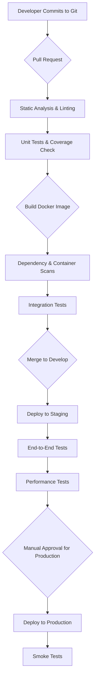

# DeenMate Backend API - Comprehensive Testing Strategy

**Date**: September 4, 2025  
**Purpose**: Ensure API reliability, performance, and security through a multi-layered testing approach.  
**Framework**: Automated, continuous, and comprehensive testing for Islamic content delivery.  

---

## Executive Summary

This document outlines the complete testing strategy for the DeenMate backend API. The strategy covers everything from unit testing individual components to end-to-end testing of the entire system, ensuring the delivery of high-quality, reliable, and secure Islamic content to our users.

---

## 1. Testing Philosophy & Principles

### 1.1 Core Principles

- **Automation First**: Automate all repetitive testing tasks to ensure consistency and efficiency.
- **Continuous Testing**: Integrate testing into every stage of the development lifecycle.
- **Shift-Left Approach**: Identify and fix defects as early as possible in the development process.
- **Risk-Based Testing**: Prioritize testing efforts based on the potential impact of failures.
- **User-Centric Testing**: Focus on testing scenarios that reflect real-world user behavior.
- **Islamic Content Integrity**: Special focus on verifying the accuracy and authenticity of Islamic content.

### 1.2 The Testing Pyramid

```mermaid
graph TD
    subgraph Testing Pyramid
        E2E_Tests[End-to-End Tests]
        Integration_Tests[Integration Tests]
        Unit_Tests[Unit Tests]
    end
    
    E2E_Tests -- "Slow, Expensive, Brittle" --> Integration_Tests
    Integration_Tests -- "Medium Speed, Medium Cost" --> Unit_Tests
    Unit_Tests -- "Fast, Cheap, Reliable"
    
    style E2E_Tests fill:#f9f,stroke:#333,stroke-width:2px
    style Integration_Tests fill:#ccf,stroke:#333,stroke-width:2px
    style Unit_Tests fill:#cfc,stroke:#333,stroke-width:2px
```

- **Unit Tests (70%)**: Foundation of the testing strategy, focusing on individual functions and components.
- **Integration Tests (20%)**: Verifying interactions between different services and components.
- **End-to-End Tests (10%)**: Simulating real user workflows from the client to the database.

---

## 2. Levels of Testing

### 2.1 Unit Testing

**Objective**: Verify the correctness of individual functions, classes, and modules in isolation.

**Tools**:
- **Framework**: `pytest` for Python/FastAPI.
- **Mocking**: `pytest-mock`, `unittest.mock`.
- **Coverage**: `pytest-cov`.

**Scope**:
- **Business Logic**: Test all business rules and logic.
- **Data Transformation**: Verify data mapping and serialization.
- **Utility Functions**: Ensure helper functions work as expected.
- **Error Handling**: Test exception handling and error paths.

**Example (FastAPI)**:
```python
# test_quran_service.py
import pytest
from app.services.quran_service import QuranService
from app.models.quran import Verse

def test_get_verse_by_id_success(mocker):
    """
    Test successful retrieval of a Quran verse.
    """
    mock_db_session = mocker.patch('app.db.session')
    mock_db_session.query.return_value.filter.return_value.first.return_value = Verse(
        id=1, chapter_id=1, verse_number=1, text_uthmani="بِسْمِ اللَّهِ الرَّحْمَٰنِ الرَّحِيمِ"
    )
    
    service = QuranService(db_session=mock_db_session)
    verse = service.get_verse_by_id(1)
    
    assert verse is not None
    assert verse.id == 1
    assert verse.text_uthmani == "بِسْمِ اللَّهِ الرَّحْمَٰنِ الرَّحِيمِ"

def test_get_verse_by_id_not_found(mocker):
    """
    Test handling of a non-existent Quran verse.
    """
    mock_db_session = mocker.patch('app.db.session')
    mock_db_session.query.return_value.filter.return_value.first.return_value = None
    
    service = QuranService(db_session=mock_db_session)
    verse = service.get_verse_by_id(9999)
    
    assert verse is None
```

### 2.2 Integration Testing

**Objective**: Verify the interaction and data flow between different components and services.

**Tools**:
- **Framework**: `pytest` with `TestClient` for FastAPI.
- **Database**: Test containers (`testcontainers-python`) for isolated DB instances.
- **API Contracts**: `Pact` for consumer-driven contract testing.

**Scope**:
- **API Endpoints**: Test API requests and responses.
- **Database Integration**: Verify data persistence and retrieval.
- **Third-Party APIs**: Test interactions with external services (e.g., Aladhan, Sunnah.com).
- **Cache Integration**: Ensure caching mechanisms work correctly.
- **Message Queue**: Test asynchronous job processing.

**Example (API Contract Testing with Pact)**:
```python
# Consumer side (Mobile App)
import pact

pact = pact.Consumer('DeenMateApp').has_pact_with(pact.Provider('DeenMateAPI'))

(pact
 .given('a prayer time for a specific location and date exists')
 .upon_receiving('a request for prayer times')
 .with_request('get', '/v1/prayer-times', query={'lat': 23.8103, 'lon': 90.4125, 'date': '2025-09-04'})
 .will_respond_with(200, body={
     'fajr': '04:30',
     'dhuhr': '12:05',
     'asr': '15:45',
     'maghrib': '18:20',
     'isha': '19:35'
 }))

with pact:
    # Code that makes the actual API call
    get_prayer_times(lat=23.8103, lon=90.4125, date='2025-09-04')

# Provider side (Backend API)
# Pact provider verification step in CI/CD pipeline
# This will replay the consumer's expectations against the actual API
```

### 2.3 End-to-End (E2E) Testing

**Objective**: Simulate real user workflows from start to finish to validate the entire system.

**Tools**:
- **Framework**: `Playwright` or `Cypress` for web-based admin panels.
- **Mobile**: `Appium` or `Flutter Integration Tests` for mobile app interactions.
- **Orchestration**: Custom scripts to set up test data and trigger workflows.

**Scope**:
- **User Journeys**:
    - User registration and login.
    - Fetching daily prayer times.
    - Reading a chapter of the Quran.
    - Calculating Zakat.
    - Finding the Qibla direction.
- **Data Integrity**: Verify data consistency across the entire system.
- **Cross-Service Communication**: Test workflows involving multiple microservices.

**Example Scenario**:
1.  **Setup**: A new user is created via an API call.
2.  **Action**: The user logs into the mobile app.
3.  **Action**: The user sets their location to Dhaka, Bangladesh.
4.  **Verification**: The app displays the correct prayer times for Dhaka.
5.  **Action**: The user bookmarks a verse from Surah Al-Fatiha.
6.  **Verification**: The bookmark is saved to the database and is visible on the user's profile screen.
7.  **Teardown**: The test user and all associated data are deleted.

---

## 3. Non-Functional Testing

### 3.1 Performance & Load Testing

**Objective**: Ensure the API can handle expected and peak user loads with acceptable performance.

**Tools**:
- **Load Generation**: `k6`, `JMeter`, or `Locust`.
- **Monitoring**: `Prometheus`, `Grafana`, `New Relic`.

**Scope**:
- **Stress Testing**: Determine the breaking point of the system.
- **Load Testing**: Simulate expected user traffic.
- **Spike Testing**: Test the system's response to sudden traffic surges (e.g., during Ramadan).
- **Endurance Testing**: Evaluate system performance over extended periods.

**Key Metrics**:
- **Response Time**: Average, 95th, and 99th percentile.
- **Throughput**: Requests per second (RPS).
- **Error Rate**: Percentage of failed requests.
- **Resource Utilization**: CPU, memory, and network usage.

**Example (k6 script)**:
```javascript
import http from 'k6/http';
import { check, sleep } from 'k6';

export const options = {
  stages: [
    { duration: '2m', target: 400 }, // ramp up to 400 users
    { duration: '5m', target: 400 }, // stay at 400 users
    { duration: '2m', target: 0 },   // ramp down to 0 users
  ],
  thresholds: {
    'http_req_duration': ['p(95)<500'], // 95% of requests must complete below 500ms
    'http_req_failed': ['rate<0.01'],   // error rate must be less than 1%
  },
};

export default function () {
  const res = http.get('https://api.deenmate.app/v1/quran/chapters/1/verses');
  check(res, { 'status was 200': (r) => r.status == 200 });
  sleep(1);
}
```

### 3.2 Security Testing

**Objective**: Identify and mitigate security vulnerabilities in the API and infrastructure.

**Tools**:
- **SAST (Static Analysis)**: `Snyk`, `Bandit`.
- **DAST (Dynamic Analysis)**: `OWASP ZAP`, `Burp Suite`.
- **Dependency Scanning**: `Snyk`, `GitHub Dependabot`.
- **Container Scanning**: `Trivy`, `Aqua Security`.

**Scope**:
- **OWASP Top 10**: Test for common web application vulnerabilities.
- **Authentication & Authorization**: Verify access control mechanisms.
- **Data Encryption**: Ensure data is encrypted at rest and in transit.
- **Input Validation**: Test for injection attacks (SQLi, XSS).
- **Rate Limiting**: Prevent denial-of-service attacks.

**Process**:
- **Automated Scans**: Integrated into the CI/CD pipeline.
- **Manual Penetration Testing**: Conducted quarterly by a third-party security firm.
- **Security Code Reviews**: Part of the pull request process.

### 3.3 Islamic Content Verification Testing

**Objective**: Ensure the accuracy, authenticity, and integrity of all Islamic content.

**Process**:
- **Automated Cross-Referencing**:
    - Compare Quranic text against multiple trusted digital sources (e.g., Tanzil.net, Quran.com).
    - Validate Hadith chains of narration (isnad) against established collections.
    - Cross-check prayer time calculations with other reputable sources for benchmark locations.
- **Manual Review by Scholars**:
    - A panel of Islamic scholars will periodically review content.
    - A "Report an Error" feature will allow users to submit corrections.
- **Data Integrity Checks**:
    - Run checksums on stored Islamic texts to detect any unauthorized modifications.
    - Automated tests to ensure translations are correctly mapped to their original Arabic texts.

---

## 4. Testing Infrastructure & Environments

### 4.1 Testing Environments

| Environment   | Purpose                               | Data Source              | Deployed From | Access Level      |
|---------------|---------------------------------------|--------------------------|---------------|-------------------|
| **Local**     | Individual developer testing          | Mock data, local DB      | Local machine | Developer         |
| **CI/CD**     | Automated unit & integration tests    | Test containers, mocks   | CI server     | Automated         |
| **Staging**   | E2E, performance, UAT testing         | Anonymized production data | `develop` branch | QA, Product, Dev  |
| **Production**| Canary testing, smoke testing         | Live user data           | `main` branch   | Limited (DevOps)  |

### 4.2 Test Data Management

- **Data Generation**: Use libraries like `Faker` to create realistic test data.
- **Data Anonymization**: Anonymize production data for use in staging environments to comply with privacy regulations (GDPR).
- **Database Seeding**: Use scripts to populate databases with a consistent set of test data before each test run.
- **Data Cleanup**: Automate the teardown of test data after tests are completed.

---

## 5. CI/CD Integration

**Objective**: Automate the entire testing process and provide rapid feedback to developers.

**Pipeline Stages**:


**Key Pipeline Features**:
- **Gated Check-ins**: Pull requests cannot be merged if any tests fail.
- **Code Coverage Enforcement**: Maintain a minimum of 80% test coverage.
- **Automated Reporting**: Test results and coverage reports are published to the pull request.
- **Notifications**: Developers are notified of build and test failures via Slack.

---

## 6. Roles & Responsibilities

- **Developers**: Write unit and integration tests for their code.
- **QA Engineers**: Develop and maintain E2E tests, performance tests, and the overall testing framework.
- **DevOps Engineers**: Manage the CI/CD pipeline and testing environments.
- **Product Managers**: Participate in User Acceptance Testing (UAT) and define acceptance criteria.
- **Islamic Scholars**: Periodically review and validate Islamic content.

---

**Testing Strategy Completed**: September 4, 2025  
**Implementation Ready**: Comprehensive testing plan for ensuring a high-quality backend API.
